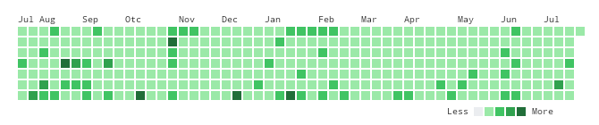

# deno-kusa-image

PNG of GitHub's Contribution Graphs

## url

```
https://kusa-image.deno.dev/?user=swfz
```

or

```
https://kusa-image.deno.dev/swfz
```

### Optional Parameter

| name  | example    | description                           |
| :---- | :--------- | :------------------------------------ |
| to    | 2024-01-01 | contribution end date                 |
| theme | dark       | dark mode only. default is light mode |

## image



## dev

- run

```
deno run --allow-net --allow-env --watch server.ts
```

- test(vrt)

```
CI=true deno run --allow-net --allow-env --watch server.ts &

cd vrt
node json-server &

yarn playwright test
```

- deploy

```
deployctl deploy --project=kusa-image --prod server.ts
```
